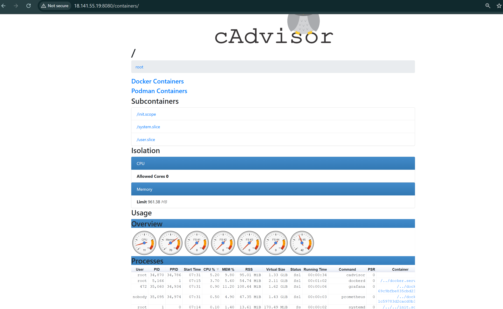

docker compose down -v --rmi all --remove-orphans
FOCUS ON:
✅ WHY services need different resources
✅ HOW to observe which service struggles
✅ WHAT happens when you scale struggling services
✅ THE EVIDENCE (metrics, load tests, visual proof)

DON'T FOCUS YET:
❌ Every line of Python code
❌ Deep Flask framework details
❌ Prometheus query language
❌ Grafana dashboard customization

CRITICAL OBSERVATIONS:
1. Response times (fast vs slow services) the payamnt is slow observer, product is fast so quick time
2. CPU usage (which service maxes out?) which service taking more cpu for service loading
3. Request throughput (requests/second) how many quests it is taking for sec
4. Success vs failure rate which one is failing why?
5. Effect of scaling (1 instance → 5 instances) if the load is coming it should be replicate

UNDERSTAND:
✅ Volumes (we'll clarify this NOW!)
✅ docker-compose scale command - vry imp
✅ Resource limits (CPU, memory) 
✅ Networking between containers

DON'T NEED TO MASTER:
❌ Building custom images (we're using base images + volumes)
❌ Advanced Dockerfile optimization
❌ Multi-stage builds (Day 2 stuff)

80% of learning comes from:
- Running the project ✅
- Observing the results ✅
- Breaking things and fixing them ✅
- Load testing and scaling ✅

20% of learning comes from:
- Understanding every line of code ❌
- Knowing all tool options ❌
- Perfect configuration ❌

time curl -s http://localhost:5001/products > /dev/null

real    0m0.021s
user    0m0.001s
sys     0m0.007s

time curl -s -X POST http://localhost:5004/payment \
  -H "Content-Type: application/json" \
  -d '{"order_id": "ORD-1234", "amount": 1000}' > /dev/null

real    0m3.014s
user    0m0.008s
sys     0m0.000s